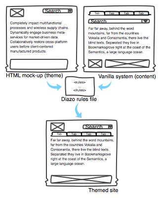

注) この文書は[Diazo: Introduction](http://docs.diazo.org/en/latest/introduction.html)をgoogle 翻訳にかけた後，フォーマットなどを少し修正したものです。少し訳を修正した部分もありますが，google 翻訳そのままの部分がほとんどです。

Diazoを使用して、動的ウェブサイトに対して次のようにテーマを適用することができます：

1. 置き換える必要のあるテーマファイル内の位置(プレースホルダ)を，例えば、HTMLのid属性で指定します。
2. Webサイト上の対応する動的コンテンツに，ラベル(マークアップ)をつけます。 次に、テーマファイルの静的プレースホルダーの中身を，動的コンテンツに置き換えるために，Diazoの`replace`や`copy`のルールを作成します。
3. テーマファイルに取り込むコンテンツを表示するフォーマットを指定します。具体的には，利用するCSSやJavaScriptを`<head />`で指定します。その指定には，Diazoの`append`や`prepend`ルールを書きます。
4. 不必要なテーマや動的なウェブサイトの部分を削除するため場合には，Diazoの`drop`ルールを書きます。

rulesファイルは、単純なXML構文を使用して記述されています。 CSS3またはXPathセレクタを使用して、テーマ内の要素と「コンテンツ」（動的Webサイト）を識別できます。

テーマHTMLファイルとルールXMLファイルを作成したら、Diazoコンパイラを使用してこれらを単一のXSLTファイルにコンパイルします。 その後、アプリケーションを使って，このXSLTファイル表示します。 XSLTプロセッサ（Apacheのmod_transformなど）は、Webサイトの動的コンテンツを、エンドユーザが見るテーマのコンテンツに変換します。 変換は各要求に対して即座に行われます。

この際
-  XSLTの行を書いたり、読んだりする必要はありません。
- 各要求に対して実行されるXSLT変換は非常に高速です。
- 静的なテーマのリソース（画像、スタイルシート、JavaScriptファイルなど）は、静的なWebサーバーから配信することができます。静的なWebサーバーは通常、動的アプリケーションから配信するよりもはるかに高速です。
- 元のテーマのHTMLをそのままにしておくことができます。これにより、他のシナリオでの再利用が容易になります。 たとえば、独立したルールファイルを持つ単一のテーマファイルを使用して、無関係な2つのアプリケーションを結合することができます。 これにより、2つのコンパイル済みXSLTファイルが作成されます。 あなたは、位置一致ルールまたは同様の手法を使用して、特定の要求に対して呼び出すルールを選択することができます。

このガイドの後半では、Diazoを導入する方法を説明します。

